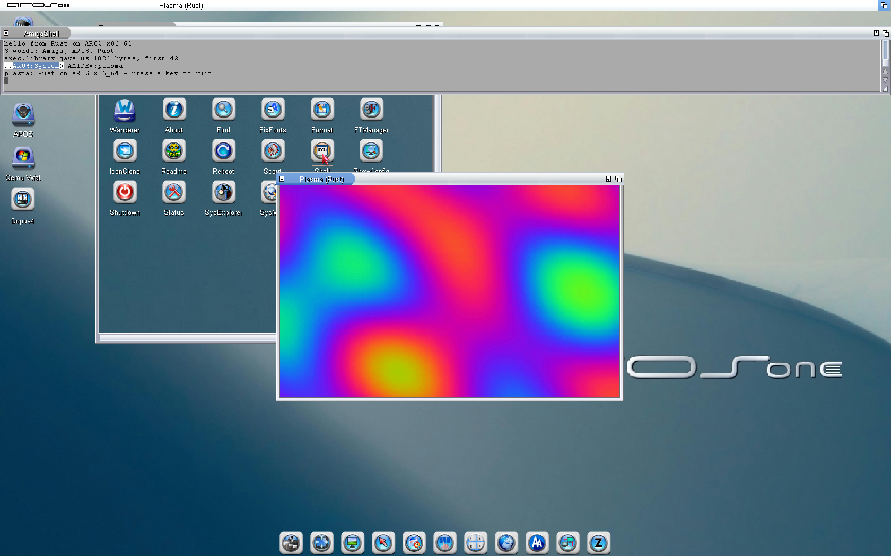

# Rust for AROS x86_64

Write AROS programs in Rust. This package contains everything needed to build
a Rust program on a PC or Mac and run it on AROS x86_64: a target definition,
a small runtime crate, a project template, a graphical example, and a helper
that deploys straight into a running AROS machine.



**This is a first release.** It is `no_std`: `core` and `alloc` work, so
`Vec`, `String`, `format!` and the collections are all available, and `no_std`
crates from crates.io build unchanged. Rust's `std` does not exist for AROS
yet, so crates that require it will not build.

Files, threads and clocks are nevertheless usable today, through the AROS
`libc` bindings in `std-groundwork/` — they are checked against the running
system — but you call them as C, not as `std::fs` or `std::thread`. Sockets
are the one real gap: on AROS they are not libc functions at all. See
*Limitations* below before you plan a project around this.

## What is known to work

Verified on AROS One 1.3 (x86_64) under QEMU:

* `core` and `alloc` — iterators, `core::fmt`, `Vec`, `String`, `BTreeMap`
* crates from crates.io that support `no_std` — tested with `libm` and
  `hashbrown`
* floating point and 128-bit arithmetic, including the division behind
  decimal formatting
* calling the AROS API directly: `PutStr`, `Delay`, `AllocMem`/`FreeMem`
* calling the C library from the SDK, including varargs functions
* SDL2: the included example opens a window and animates a 320x200 plasma at
  **226 fps** inside emulation, without hardware acceleration

## Requirements

* An AROS x86_64 SDK and cross toolchain (`x86_64-aros-gcc`).
* Rust nightly with the sources:
  `rustup toolchain install nightly --profile minimal --component rust-src`
  Nightly is required because custom target files and `-Z build-std` are not
  stable features.

## Quick start

```sh
./setup.sh                    # finds your toolchain, writes x86_64-aros.json
cd template
cargo +nightly build --release
```

`setup.sh` looks for `x86_64-aros-gcc` on your `PATH` and for the SDK beside
it. If it guesses wrong, tell it:

```sh
AROS_GCC=/path/to/x86_64-aros-gcc AROS_SDK=/path/to/sdk ./setup.sh
```

The result, `target/x86_64-aros/release/hello-aros`, is an ordinary AROS
executable: copy it to your AROS machine and run it from a Shell.

### Optional: `cargo run` straight into QEMU

If you develop against AROS running in QEMU, `cargo run` can build, deploy and
start the program for you:

```sh
cd examples/plasma
cargo +nightly run --release
```

This uses `tools/aros-qemu-run.py`, which publishes the binary on a small ISO,
swaps it into the machine's CD drive and types the command into an open Shell.
It needs QEMU started with a monitor socket, a QMP socket and a CD drive:

```
-monitor unix:/tmp/aros-monitor.sock,server,nowait
-qmp     unix:/tmp/aros-qmp.sock,server,nowait
-drive   if=ide,index=2,media=cdrom
```

and an AmigaShell window open and focused in the guest. Socket paths, the
drive id and the volume name can be overridden with environment variables;
see the top of the script. It needs nothing but Python 3 and an ISO builder
(`hdiutil`, `xorriso`, `genisoimage` or `mkisofs`).

The result comes back as a screenshot rather than as text: AROS gives no way
to send output back to the host. Writing to a QEMU vvfat drive from inside the
guest looks like it works and silently produces a corrupt file, and `SER:`
never reaches QEMU's serial file, so neither is a usable channel.

## What is in the box

| Path | What it is |
|---|---|
| `setup.sh` | Detects your toolchain and writes the target definition. |
| `x86_64-aros.json.in` | Target definition template; see `TARGET-NOTES.md`. |
| `aros/` | The runtime crate: allocator, `println!`, panic handler, bindings. |
| `template/` | A minimal project to copy for your own program. |
| `examples/plasma/` | A graphical SDL2 example. |
| `tools/aros-qemu-run.py` | `cargo run` helper for a QEMU-hosted AROS. |
| `std-groundwork/` | Work towards a real `std`: `libc` bindings and their tests. |

## Writing a program

```rust
#![no_std]
#![no_main]

extern crate alloc;
use aros::{aros_main, println};

fn run() {
    println!("hello from Rust on AROS");
}

aros_main!(run);
```

The SDK's C startup still runs the process; `aros_main!` exposes your function
to it. The `aros` crate installs the allocator and the panic handler, so
nothing else is needed.

Memory from exec.library comes with its pairing rule enforced by the compiler:

```rust
let mut buf = aros::exec::Mem::new(1024).unwrap();
buf[0] = 42;
// FreeMem happens on drop, with the size it was allocated with
```

## Limitations

* **No `std`.** Crates that require it will not build. This is the main gap,
  and closing it is the obvious next step.
* **Nightly only**, and nightly moves; a future release may need the target
  file adjusted.
* **Safety stops at the API boundary.** Calls into AROS are `unsafe` FFI like
  any other C interface, and AROS shares one address space between all tasks.
  Rust protects the logic you write, not the system you call.
* **`panic = abort`.** There is no unwinder, so a panic prints and exits.
* **Do not `strip` the executable.** A full strip leaves an AROS binary whose
  relocations the loader silently skips, and it crashes before `main`. Use
  `--strip-unneeded --remove-section .comment` if you must; the saving is
  small because the relocations need the symbols.
* **The console is not UTF-8** — keep printed text to ASCII.
* Binaries are larger than the C equivalent, and they cannot be fully
  stripped, so expect a few hundred kilobytes for a small program.

## Towards `std`

`std-groundwork/` holds the next step: a `libc` crate for AROS, generated from
the SDK and validated by running against the system rather than adapted from
another platform. It binds 75 functions and passes checks covering file I/O,
`stat`, directory listing, clocks, threads and mutexes on real AROS.

It also records what a `std` port will have to deal with: there is no POSIX
`open` symbol (the plain name belongs to exec.library), no `fork`, no `mmap`,
and sockets are not libc functions at all. Files, time, threads and
synchronisation, on the other hand, look reusable as they stand. See
`std-groundwork/README.md`.

## Prior art and credit

James Knipping ported the Zed editor and the ferail file manager to **AROS
aarch64**, which is what showed that Rust on AROS was possible at all; those
run under Macaros, AROS hosted on Apple Silicon. That work is not public, and
this package was built independently for **x86_64**, which is where AROS
desktop users are.

## License

MIT — see `LICENSE`.
